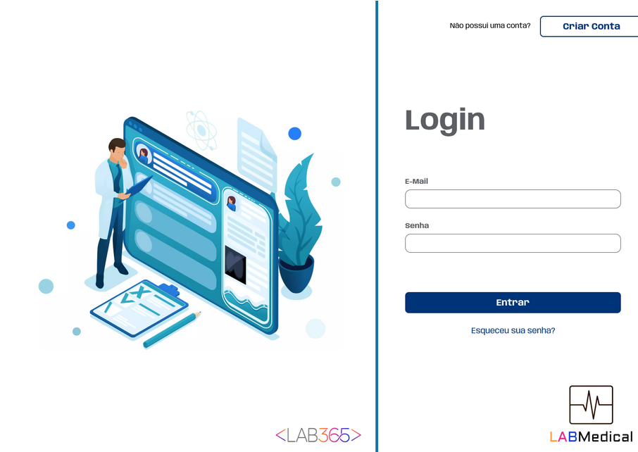
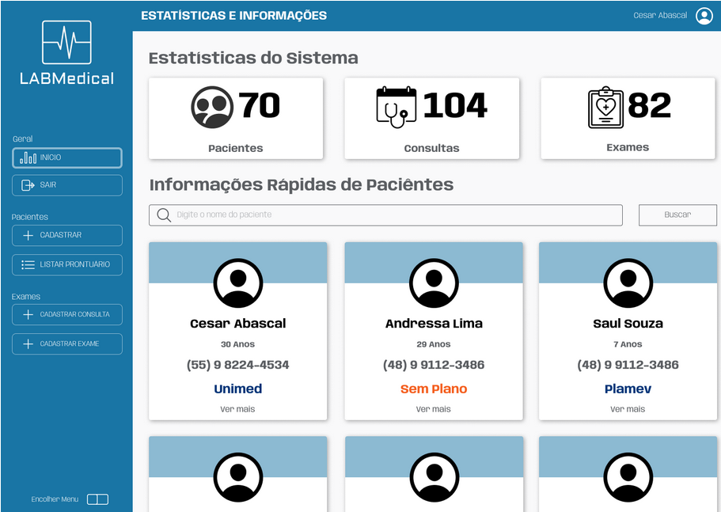

<p align="center">
  
</p>

<h1 align="center">LABMedical</h1>



<br>

# Descrição do Projeto

<p align="center">🚀 Repositorio da resolução do projeto avaliativo 2 - módulo 1 do curso DevinHouse - Turma Philips.

Ao construir a aplicação proposta, foi colocada em prática os aprendizados em:

- **Kanban Board**: O que é Kanban e utilização no Trello.
- **Versionamento**: aplicações e utilização no Github, com criação de branches e pulls request.
- **HTML e CSS**: HTML5 (elementos semânticos) e CSS/SCSS (seletores, principais estilos, layouts e flexbox).
- **Typescript**: Tipos Basicos e Objetos, Funções, Declarações de Fluxo de Controle, Classes, Interfaces.
- **Angular**: Setup Inicial (instalação e configuração), Angular CLI, Estrutura, Bootstrap, Componentes, Property Binding, Passagem de Valores, Injeção de Dependência, Eventos de Componentes, Rotas, Navegação Segura, Decorators, Diretivas (ngIf e ngFor) e ng-content.
</p>

<br>

# ✨ Features



- [x] Cadastro/Edição Pacientes
- [x] Remoção de Pacientes, com Regras de Negocio
- [x] Cadastro/Edição/Deleção De Exames/Consultas
- [x] Aplicação persiste/carrega os dados em banco
- [x] Login e Angular Guards
- [x] Cadastro de Usuarios
- [x] Estatísticas das quantidade de Pacientes/Consultas/Exames

# ✅ Pré-requisitos

Antes de começar, você vai precisar ter instalado em sua máquina as seguintes ferramentas:
[Git](https://git-scm.com), [Node.js](https://nodejs.org/en/).

# 🎲 Rodando a Aplicação

```bash
# Clone este repositório
$ git clone <https://github.com/thiagobcoelho25/DEVinHouse-Modulo_1_Projeto_Avaliativo_2>

# Acesse a pasta do projeto no terminal/cmd
$ cd app

# Instale as dependências
$ npm install

# Execute a aplicação com o seguinte comando
$ npm run all

# O servidor de recursos do banco de dados inciará na porta:3000 - acesse <http://localhost:3000/resultados>

# O recursos frontend se inciará na porta:4200 - acesse <http://localhost:4200/>
```

<br>
<br>

# Tecnologias

As seguintes ferramentas foram usadas na construção do projeto:

- [Node.js](https://nodejs.org/en/)
- [Json-Server](https://www.npmjs.com/package/json-server)
- [Typescript](https://www.typescriptlang.org/)
- [SCSS](https://sass-lang.com/)
- [Angular](https://angular.io/)
- [Angular Material](https://material.angular.io/)

<br>
<br>

# Autor

<br>

<a href="https://github.com/thiagobcoelho25">
 
 <br />
 <sub><b>Thiago Ribeiro</b></sub></a> <a href="https://github.com/thiagobcoelho25" title="Rocketseat">🚀</a>

Feito com ❤️ por Thiago Ribeiro 👋🏽 Entre em contato!

[](https://www.linkedin.com/in/thiagobcoelho25/)
[](mailto:thiagobcoelho25@gmail.com)
